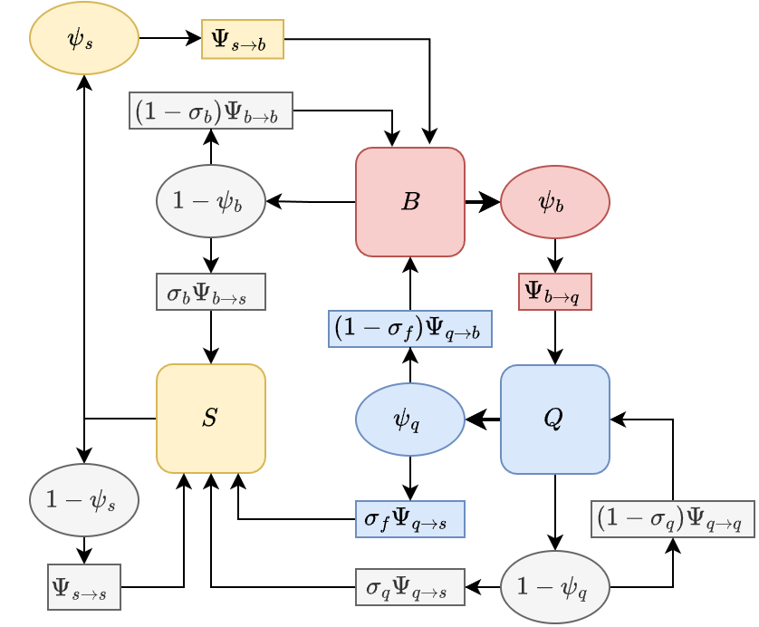

# Adult Mosquitoes - BQS

The `BQS` model describes a discrete-time, behavioral state model for
adult mosquitoes moving on point sets. The model has three states: blood
feeding $B,$ egg laying $Q,$ and sugar feeding $S.$

## Point Sets

We define this class of micro-simulation models on point sets
representing the locations of resources: haunts where mosquitoes rest
and where a mosquito might find and feed on a vertebrate host; and
aquatic habitats where mosquitoes could find aquatic habitats and lay
eggs.

- Let $\left\{ b \right\}$ denote the point set where blood feeding
  could occur;

- Let $\left\{ q \right\}$ denote the point set where egg laying could
  occur;

- Let $\left\{ s \right\}$ denote the point set where sugar feeding
  could occur;

## Dispersal

Movement among point sets is modeled using matrices that describe where
mosquitoes move each time step. The proportion moving from a point in
one set to another, from $x \in \left\{ x \right\}$ to
$y \in \left\{ y \right\}$, is described by a matrix
$\Psi_{y\leftarrow x}$ or equivalently $\Psi_{yx}$. Similarly, the
proportion moving from a point in one set to a point in the other is
$\Psi_{xx}$.

- Note that the diagonal of $\Psi_{x\leftarrow x}$ is the probability of
  staying.

- Mortality while searching is referenced to the source point, and it is
  *not* part of the dispersal matrices.

- We assume that every surviving mosquito ends up somewhere. Since there
  are a finite number of destinations, each column is a probability mass
  function (PMF).

**Searching for Blood**

- Let $\Psi_{b\leftarrow q}$ denote a matrix describing the location
  where mosquitoes end their flights in $\left\{ b \right\}$ starting
  from each point in $\left\{ q \right\}$.

- Let $\Psi_{b\leftarrow b}$ denote a matrix describing the location
  where mosquitoes end their flights in $\left\{ b \right\}$ starting
  from each point in $\left\{ b \right\}$.

- Let $\Psi_{b\leftarrow s}$ denote a matrix describing the location
  where mosquitoes end their flights in $\left\{ b \right\}$ starting
  from each point in $\left\{ s \right\}$.

**Searching for Aquatic Habitats**

- Let $\Psi_{q\leftarrow b}$ denote a matrix describing the location
  where mosquitoes end their flights in $\left\{ q \right\}$ starting
  from each point in $\left\{ b \right\}$.

- Let $\Psi_{q\leftarrow q}$ denote a matrix describing the location
  where mosquitoes end their flights in $\left\{ q \right\}$ starting
  from each point in $\left\{ q \right\}$.

- Let $\Psi_{q\leftarrow s}$ denote a matrix describing the location
  where mosquitoes end their flights in $\left\{ q \right\}$ starting
  from each point in $\left\{ s \right\}$.

**Searching for Sugar**

- Let $\Psi_{s\leftarrow b}$ denote a matrix describing the location
  where mosquitoes end their flights in $\left\{ s \right\}$ starting
  from each point in $\left\{ b \right\}$.

- Let $\Psi_{s\leftarrow q}$ denote a matrix describing the location
  where mosquitoes end their flights in $\left\{ s \right\}$ starting
  from each point in $\left\{ q \right\}$.

- Let $\Psi_{s\leftarrow s}$ denote a matrix describing the location
  where mosquitoes end their flights in $\left\{ s \right\}$ starting
  from each point in $\left\{ s \right\}$.

## Variables & Terms

In the simulation models, the number of adult mosquitoes emerging from
each aquatic habitat on each day is a vector denoted $\Lambda_{t}$ that
can be either passed as a parameter or simulated using a population
dynamic model for aquatic immature population dynamics. Adult mosquitoes
are located at one of these points at each point in time (, one day),
represented as a set of vectors: $B_{t}$, the number seeking blood at
haunts; or $Q_{t}$, the number attempting to lay eggs at habitats.

**Emerging Adults**

- Let $\Lambda_{t}$ denote the number of recently emerged mosquitoes at
  $\left\{ q \right\}$

- Note that $\Lambda_{t}$ can be passed as a parameter, or it could be
  computed from a model for aquatic mosquito dynamics.

**Adults in Behavioral States**

- Let $B_{t}$ denote the number of *blood feeding* mosquitoes at
  $\left\{ b \right\}$

- Let $Q_{t}$ denote the number of *egg laying* mosquitoes at
  $\left\{ q \right\}$

- Let $S_{t}$ denote the number of *sugar feeding* mosquitoes at
  $\left\{ s \right\}$

## Parameters

Mosquito bionomics can depend on both behavioral state and location,
including daily survival and daily blood feeding or egg laying success.
Note that survival is linked to the point where the search started, but
foraging success is linked to the point where the mosquito ends up after
moving in a time step.

**Survival:**

- Let $p_{b}$ denote the probability of surviving for a mosquito at
  $\left\{ b \right\}$ at time $t$

- Let $p_{q}$ denote the probability of surviving for a mosquito at
  $\left\{ q \right\}$ at time $t$

- Let $p_{s}$ denote the probability of surviving for a mosquito at
  $\left\{ s \right\}$ at time $t$

**Foraging Success:**

- Let $\psi_{b}$ denote the probability of blood feeding for a mosquito
  at $\left\{ b \right\}$ at time $t$ and let
  ${\widehat{\psi}}_{b} = 1 - \psi_{b}$

- Let $\psi_{q}$ denote the probability of laying eggs for a mosquito at
  $\left\{ q \right\}$ at time $t$ and let
  ${\widehat{\psi}}_{q} = 1 - \psi_{q}$

- Let $\psi_{s}$ denote the probability of sugar feeding for a mosquito
  at $\left\{ s \right\}$ at time $t$ and let
  ${\widehat{\psi}}_{s} = 1 - \psi_{s}$

## State Transitions

In the models with sugar feeding, we to describe the frequency of
switching to sugar feeding from other states. Each day, some fraction of
mosquitoes switch to a sugar feeding state from various points in the
feeding cycle (Figure 1):

- a switch to sugar feeding occurs in a fraction of recently emerged
  mosquitoes, $\sigma_{\Lambda}$;

- switch to sugar feeding occurs after egg laying, $\sigma_{f}$;

- a fraction of egg laying mosquitoes switches to sugar feeding after a
  failed egg laying attempt, $\sigma_{q}$. We implicitly assume that the
  eggs in each batch are lost.

- a fraction of blood feeding mosquitoes switches to sugar feeding after
  a failed flood feeding attempt, $\sigma_{b}$.

We assume that all mosquitoes revert to blood feeding after sugar
feeding, implying that the mosquito resorbed the eggs. We also assume
that mosquitoes would never attempt to sugar feed after a blood meal,
but that they would instead always attempt to lay eggs at least once
(Fig. 1).

------------------------------------------------------------------------

**Figure 1** - A diagram of the `BQS` model

------------------------------------------------------------------------

## Dynamics

In the basic feeding cycle model over one time step, mosquitoes either
attempt to blood feed or attempt to lay eggs. The result of an attempt
is either survival or death, and if the mosquito survives, success or
failure. A success moves a mosquito to the other state, and if they
fail, they must try again. Either way, the mosquito moves to a point in
the set for the resource they seek:

The equations for sugar feeding are:

$$\begin{array}{l}
{\begin{bmatrix}
B_{t} \\
Q_{t} \\
S_{t} \\

\end{bmatrix} = \begin{bmatrix}
{\Psi_{bq} \cdot p_{q}{\widehat{\sigma}}_{\Lambda}\Lambda_{t - 1}} \\
0 \\
{\Psi_{sq} \cdot p_{q}\sigma_{\Lambda}\Lambda_{t - 1}} \\

\end{bmatrix} + \begin{bmatrix}
{\Psi_{bb} \cdot \text{diag}\left( {\widehat{\sigma}}_{b}{\widehat{\psi}}_{b} \right)} & {\Psi_{bq} \cdot \text{diag}\left( {\widehat{\sigma}}_{f}\psi_{q} \right)} & {\Psi_{bs} \cdot \text{diag}\left( \psi_{s} \right)} \\
{\Psi_{qb} \cdot \text{diag}\left( \psi_{b} \right)} & {\Psi_{qq} \cdot \text{diag}\left( {\widehat{\sigma}}_{q}{\widehat{\psi}}_{q} \right)} & (0) \\
{\Psi_{sb} \cdot \text{diag}\left( \sigma_{b}\psi_{b} \right)} & {\Psi_{sq} \cdot \text{diag}\left( \left( \sigma_{f}\psi_{q} + \sigma_{q}{\widehat{\psi}}_{q} \right) \right)} & {\Psi_{ss} \cdot \text{diag}\left( {\widehat{\psi}}_{s} \right)} \\
 & & 
\end{bmatrix}\begin{bmatrix}
{p_{b}B_{t - 1}} \\
{p_{q}Q_{t - 1}} \\
{p_{s}S_{t - 1}}
\end{bmatrix}}
\end{array}$$
