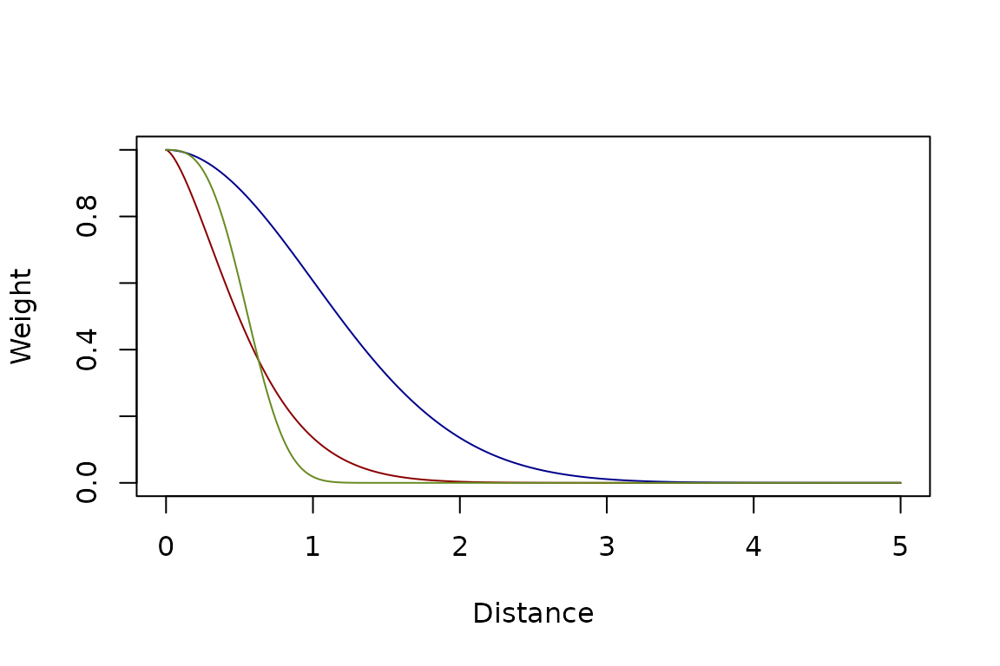
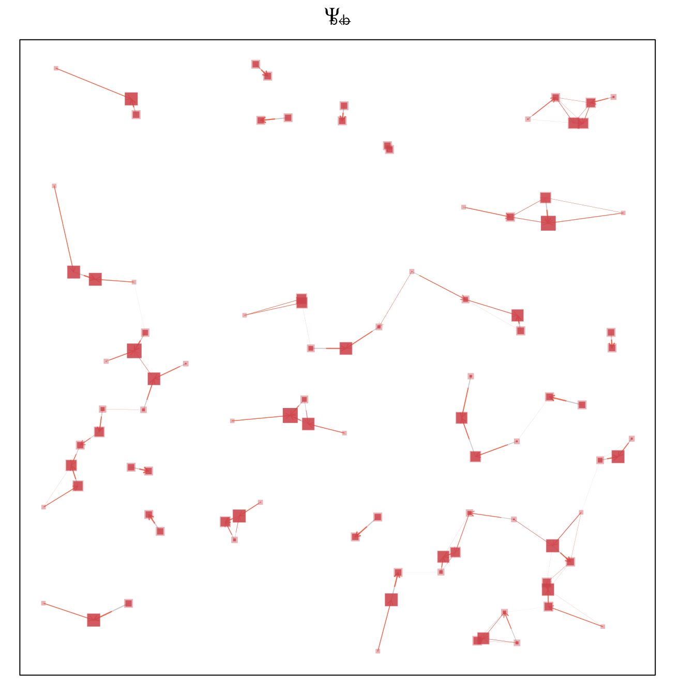
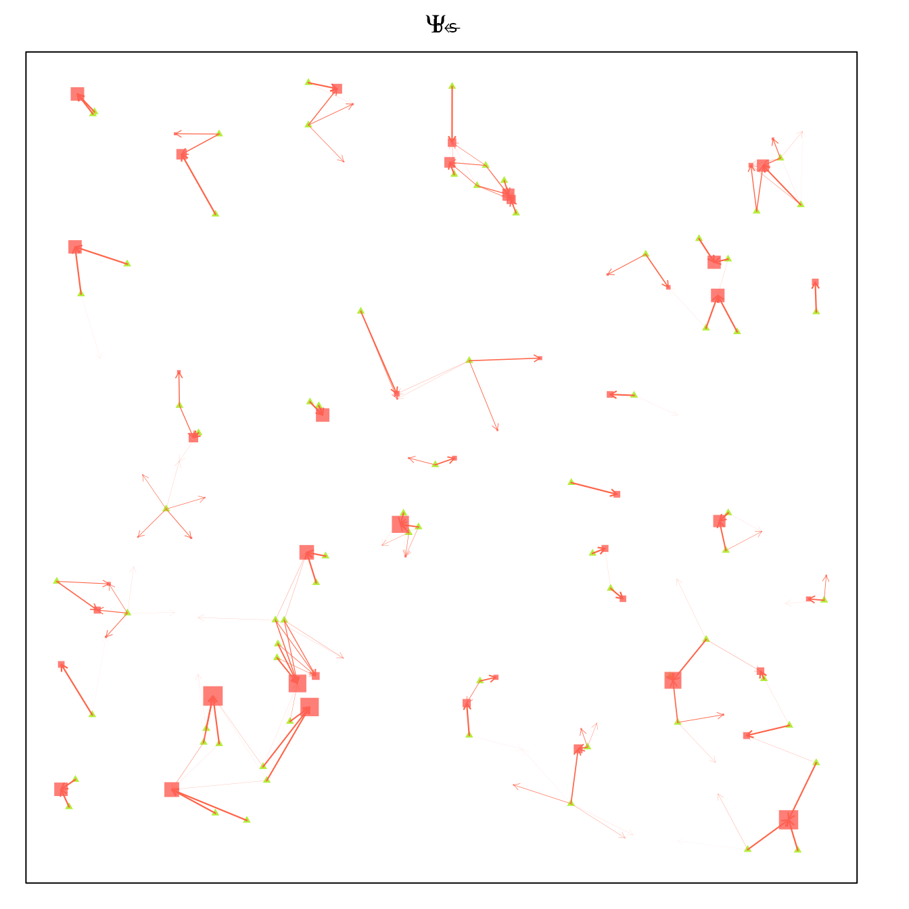
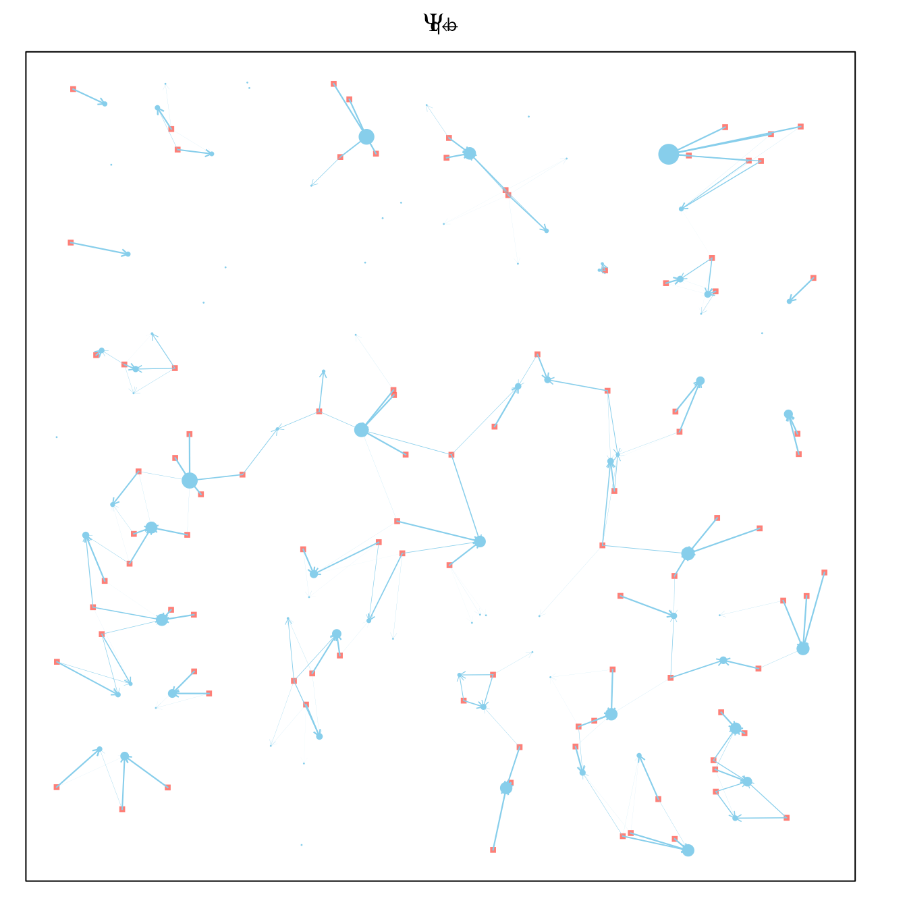
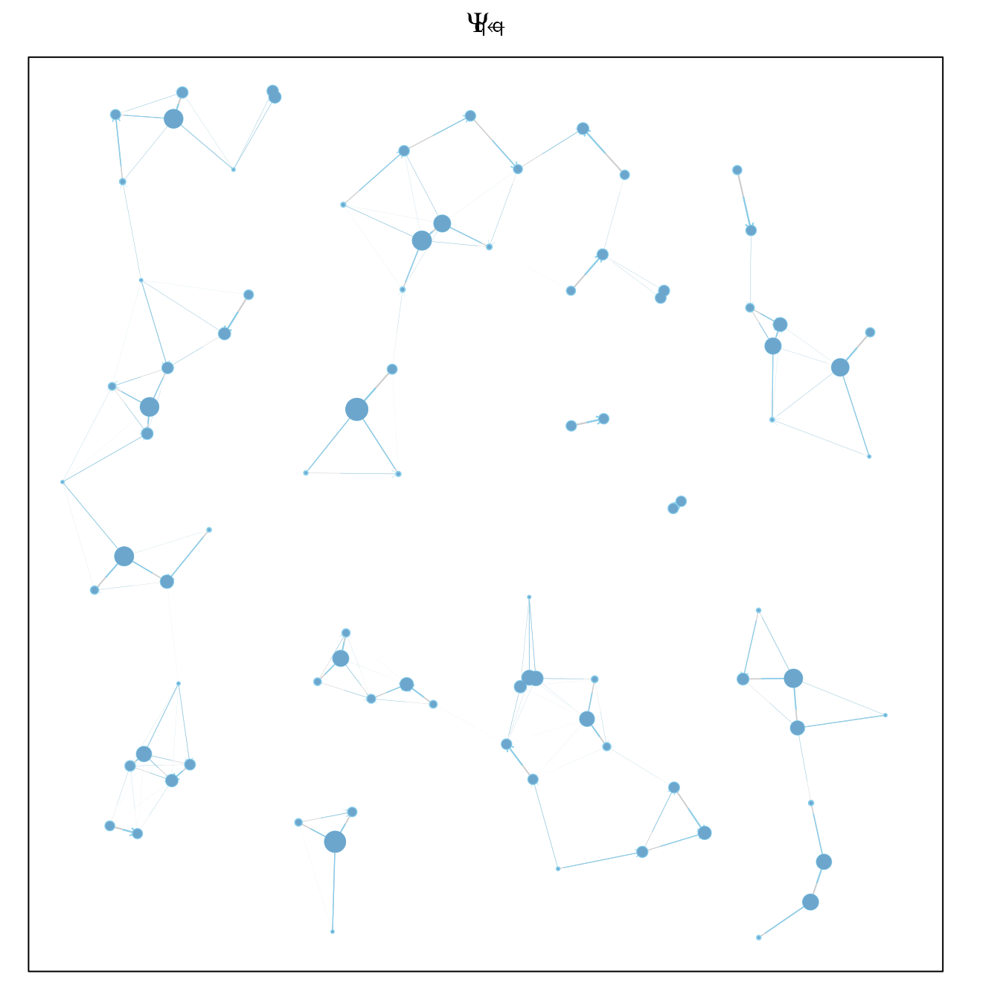
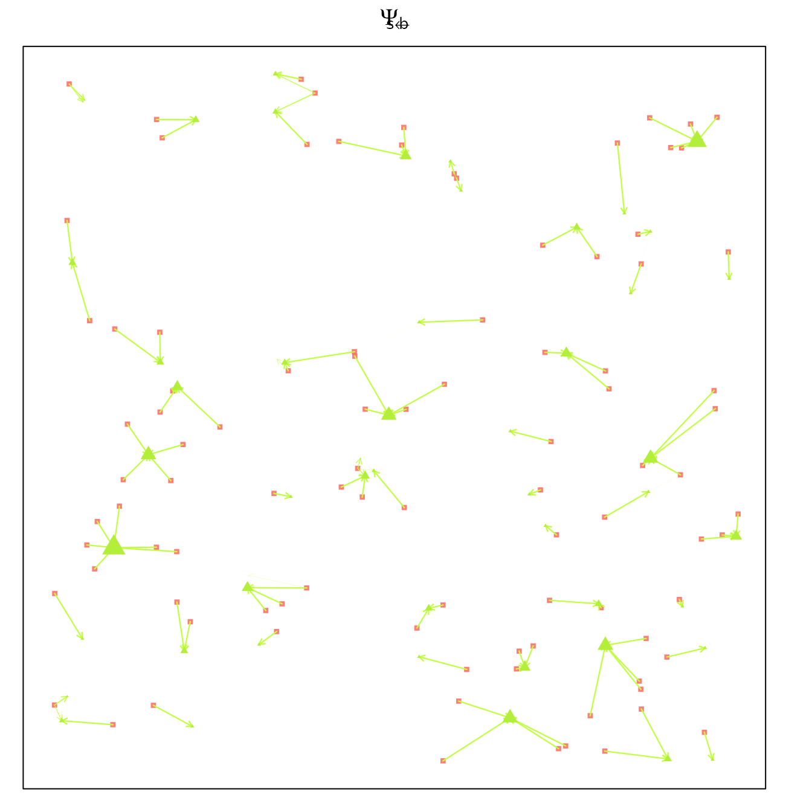
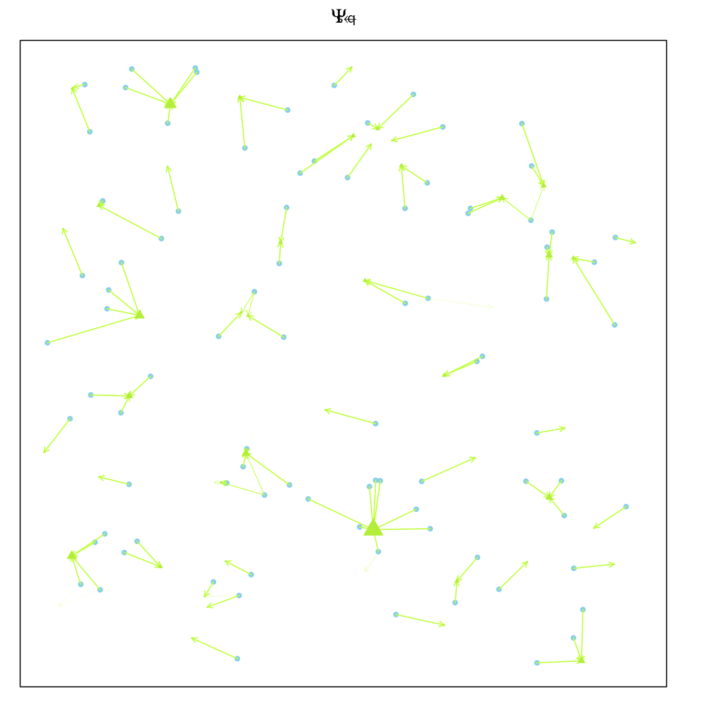
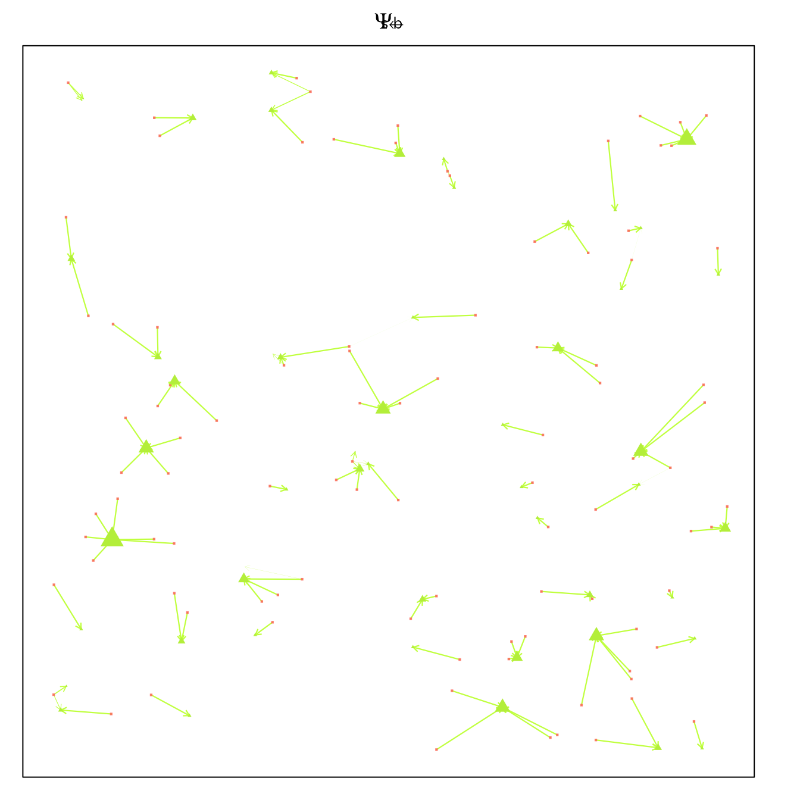
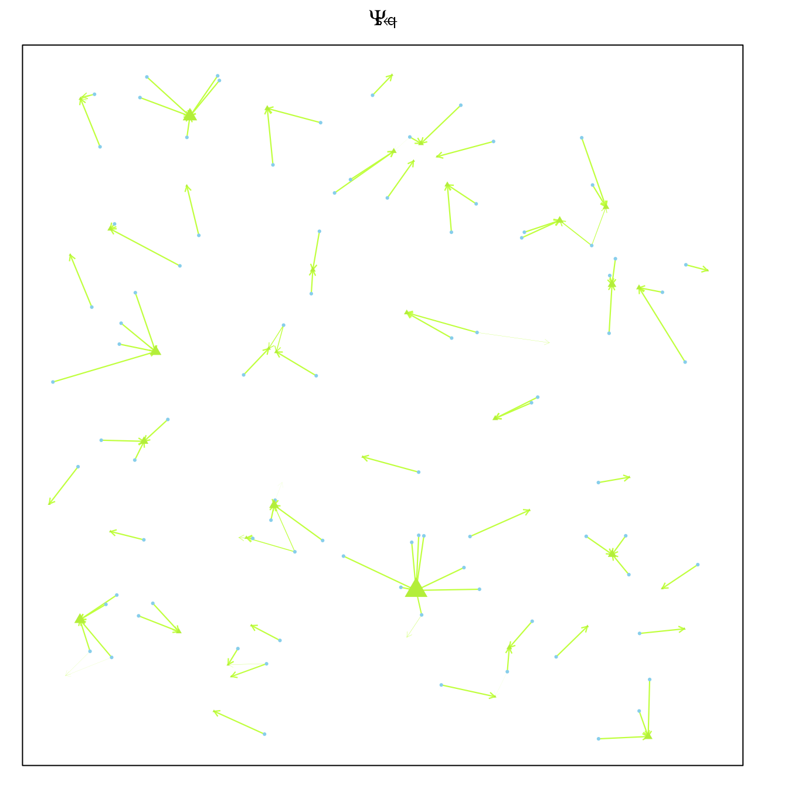
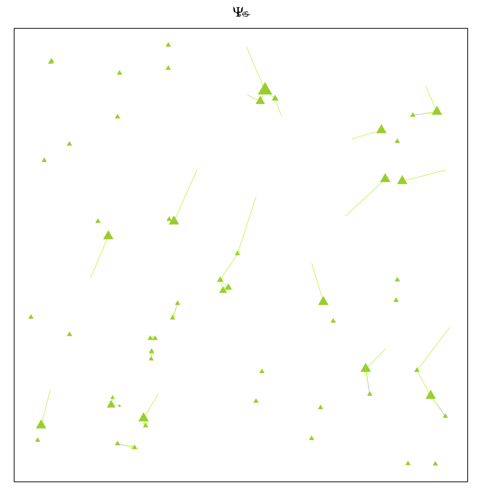

# Kernels

``` r
library(ramp.micro)
```

## Point Sets

``` r
set.seed(24328)
bb = unif_xy(96, -17, 17) 
qq = unif_xy(89, -17, 17) 
ss = unif_xy(72, -17, 17) 
```

## Kernel Shapes

We use functions to generate the probability of finding a point as a
function of its distance and context. Let $d_{i,j}$ denote the distance
from point $i$ to $j$. A scalar $\omega_{j}$ is a linear weight on each
destination making it more or less attractive from every distance.

We define some function, $F_{w}$ that assigns a weight to every
potential destination by distance. These weights are used to compute
dispersal matrices (see below).

### Exponential

The exponential family of functions has the following form

$$w_{j\rightarrow i} = F_{w}\left( d_{i,j} \right) = \omega_{j}e^{- k{(\frac{d_{i,j}}{s})}^{\gamma}}.$$

``` r
kFb = make_kF_exp(k=2, s=1, gamma=1.5)
kFq = make_kF_exp(k=2, s=2, gamma=2)
kFs = make_kF_exp(k=0.5, s=0.5, gamma=3)
```

``` r
dd = seq(0, 5, by = 0.01)
plot(dd, kFb(dd), type = "l", col = "darkred", xlab = "Distance", ylab = "Weight")
lines(dd, kFq(dd), type = "l", col = "darkblue")
lines(dd, kFs(dd), type = "l", col = "olivedrab4")
```



### Power Law

Another function family for weight by distance is the distance raised to
a power.

$$w_{j\rightarrow i} = F_{w}\left( d_{i,j} \right) = \frac{\omega_{j}}{\left( s + d_{i,j} \right)^{\delta}}.$$

``` r
kFb1 = make_kF_pwr(s=10, delta=1)
kFq1 = make_kF_pwr(s=1, delta=3)
kFs1 = make_kF_pwr(s=0.01, delta=2)
```

``` r
dd = seq(0, 5, by = 0.01)
plot(dd, kFb1(dd), type = "l", col = "darkred", xlab = "Distance", ylab = "Weight", ylim = c(0,1))
lines(dd, kFq1(dd), type = "l", col = "darkblue")
lines(dd, kFs1(dd), type = "l", col = "olivedrab4")
```



### Mixture

The next function the sum of the two previous functions, where
$\epsilon$ is the *weight* on each one of the functions.

$$w_{j\rightarrow i} = F_{w}\left( d_{i,j} \right) = \omega_{j}\left( (1 - p)e^{- k{(\frac{d_{i,j}}{s_{1}})}^{\gamma}} + \frac{p}{\left( s_{2} + d_{i,j} \right)^{\delta}} \right).$$

## Dispersal Matrices

Movement among point sets is modeled using matrices that describe where
mosquitoes end up after dispersing in a single time step. The proportion
moving from a point in one set to another, from
$x \in \left\{ x \right\}$ to $y \in \left\{ y \right\}$, is described
by a matrix $\Psi_{y\leftarrow x}$ or equivalently $\Psi_{yx}$.
Similarly, the proportion moving from a point in one set to a point in
the other is $\Psi_{xx}$.

In translating distances into a probability mass function using the
kernel shapes, we let

$$w_{i,j} = F_{w}\left( d_{i,j} \right)$$ These weights are normalized
and translated into proportions: the proportion arriving at each point
in a destination set index by $j$ from a source set indexed by $i$ is
normalized across all destinations from each starting point:

$$\Psi_{j,i} \in \Psi = \frac{w_{i,j}}{\sum\limits_{i}w_{i,j}}$$

Note that in the simulation models, these matrices describe the
destinations for surviving mosquitoes, so we constrain the formulas such
that each column sums to one. Mortality associated with dispersing is
associated with the source points.

### Blood Feeding

After emerging or after blood feeding, mosquitoes move from aquatic
habitats to blood feed.

``` r
par(mar = c(1,1,2,2))
Psi_bq = make_Psi_xy(qq, bb, kFb, w=1)
plot_Psi_bq(bb, qq, Psi_bq)
```



If they are unsuccessful, they will try to blood feed again. In the
visualization, asymmetries arise because of the distribution of other
points: $a$ and $b$ are close, and both are further away from $c$ so
mosquitoes will tend to go back and forth between $a$ and $b$ and away
from $c.$ The asymmetry is plotted by letting the colored portion of the
arrow *start*

``` r
par(mar = c(1,1,2,2))
Psi_bb = make_Psi_xx(bb, kFb, w=1, stay=0.5)
plot_Psi_bb(bb, qq, Psi_bb)
```



``` r
par(mar = c(1,1,2,2))
Psi_bs = make_Psi_xy(ss, bb, kFb, w=1)
plot_Psi_bs(bb, qq, ss, Psi_bs)
```



### Egg Laying

After blood feeding, mosquitoes move from blood feeding sites to aquatic
habitats.

``` r
par(mar = c(1,1,2,2))
Psi_qb = make_Psi_xy(bb, qq, kFb, w=1)
plot_Psi_qb(bb, qq, Psi_qb)
```



If they fail, mosquitoes will move again.

``` r
par(mar = c(1,1,2,2))
Psi_qq = make_Psi_xx(qq, kFq, w=1, stay=0.3)
plot_Psi_qq(bb, qq, Psi_qq)
```



### Sugar Feeding

``` r
par(mar = c(1,1,2,2))
Psi_sb = make_Psi_xy(bb, ss, kFs, w=1)
plot_Psi_sb(bb, qq, ss, Psi_sb)
```



``` r
par(mar = c(1,1,2,2))
Psi_sq = make_Psi_xy(qq, ss, kFs, w=1)
plot_Psi_sq(bb, qq, ss, Psi_sq)
```



``` r
par(mar = c(1,1,2,2))
Psi_ss = make_Psi_xx(ss, kFs, w=1, stay=0.05)
plot_Psi_ss(bb, qq, ss, Psi_ss)
```


