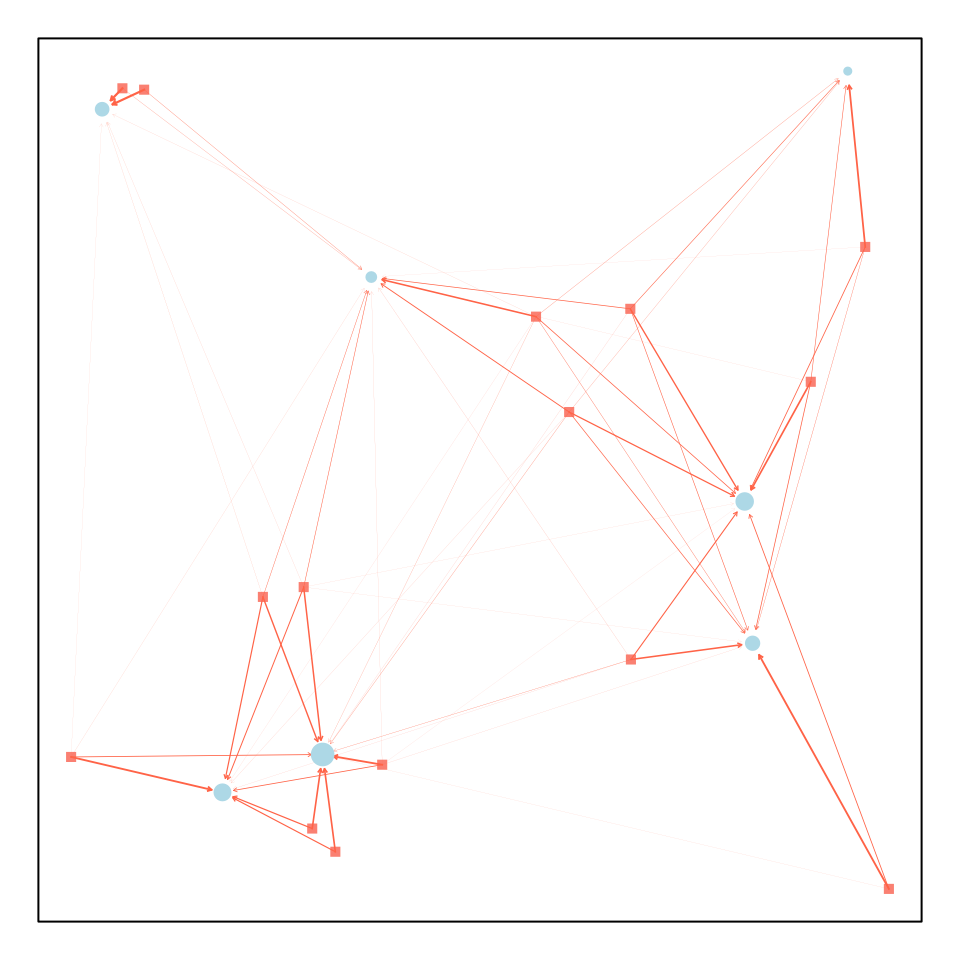
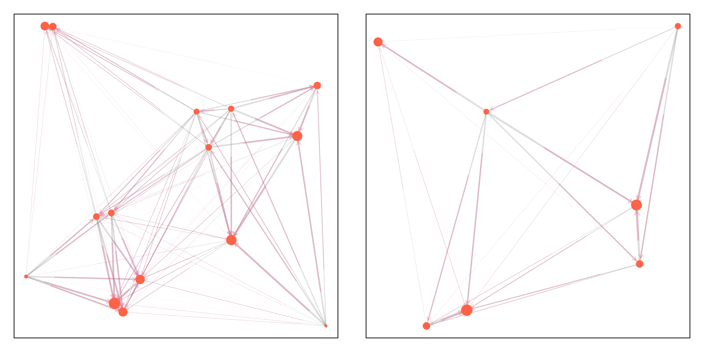

# On Dispersal Matrices

``` r
library(viridisLite)
library(knitr)
library(viridis)
library(ramp.micro)
#suppressWarnings(devtools::load_all() )
set.seed(25)
```

## Introduction

In behavioral state micro-simulation, mosquito movement is defined by a
*search* for a resource, and all resources are located at points in
space, $(x,y).$ Micro-dispersal is defined herein as dispersal among
point sets representing the locations of resources.

Micro-dispersal models in this software implementation follow a common
notation:

- A search originates in one point set, $P_{v}$, with $|v|$ locations;
  and the destination is another, $P_{w}$ with $|w|$ locations.

- A dispersal model is instantiated as a matrix $M_{w\leftarrow v},$
  where the element $M_{i,j} \in M$ is the fraction of mosquitoes moving
  from $\left( x_{j},y_{j} \right) \in P_{v}$ to
  $\left( x_{i},y_{i} \right) \in P_{w}$.

- If we had a vector, $m_{v}$, of mosquito abundances at the origin of a
  search, and if we want to compute a vector, $m_{w}$, describing the
  number arriving at a destination, then we write
  $$m_{w} = M \cdot m_{v},$$ where

  - $\text{dim}(M) = |w| \times |v|,$

  - and $\left| m_{v} \right| = |v|,$

  - so $\left| m_{w} \right| = |w|.$

By convention, we constrain model so that,
$$\sum\limits_{i}M_{i,j} = 1.$$

If we want to model failed dispersal, then we will often want to handle
the case where the origin and destination are the same point set.

In the following, we discuss the challenge of visualizing
micro-dispersal matrices using functions in `motrap.micro` where either
$P_{v} \neq P_{w}$ or where $P_{v} = P_{w}.$

## Dispersal from $P_{v} \neq P_{w}$

To illustrate, we generate two point sets:

``` r
nPv = 15 
nPw = 7
dd = 10
Pv = unif_xy(nPv,-dd, dd) 
Pw = unif_xy(nPw,-dd, dd) 
```

Now, we can define a dispersal matrix from $S$ to $D$:

``` r
M_wv = make_Psi_xy(Pv, Pw)
```

The generic function `plot_Mxy` was developed to plot dispersal from
$P_{v}$ to $P_{w}.$



``` r
M_vw = make_Psi_xy(Pw, Pv)
Mvv = M_vw %*% M_wv
Mww = M_wv %*% M_vw
```


