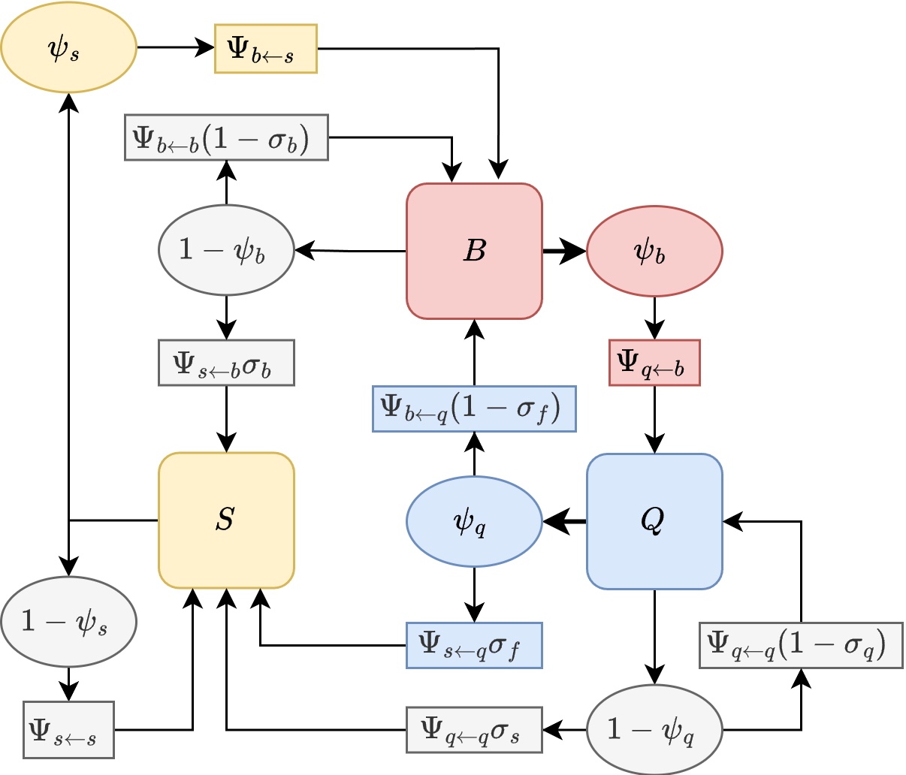

# Setting the Trap

To quantify mosquito movement through one phase of the feeding cycle –
either blood feeding or egg laying – that involves an initial search
from another resource that could be followed by several failures, we
developed a \`\`trap’’ algorithm that computes isolates one part of the
feeding cycle.

To do so, we modify the simulation by setting to zero the parameters
describing how mosquitoes would leave the *trap* state. We then
initialize and follow a cohort from the point it enters that state,
iterating until almost surviving mosquitoes accumulate in the end state
(*i.e.*, up to a predefined tolerance). We let $K_{b\leftarrow q}$
denote a $|b| \times |q|$ matrix describing net dispersal to blood feed
once: it is the proportion of mosquitoes leaving $\left\{ q \right\}$
after laying eggs that eventually blood feed successfully at each point
in $\left\{ b \right\}$. Similarly, we define $K_{q\leftarrow b}$ denote
net dispersal to lay eggs after.

## BQ Model

In the case of blood feeding, we begin with a cohort of mosquitoes in
$\left\{ q \right\}$ that has just successfully laid eggs. In the `BQ`
model, all these mosquitoes launch in search of blood, some of them
surviving to end up at a point in in $\left\{ b \right\}$:

$$B_{0} = \Psi_{b\leftarrow q} \cdot \text{diag}\left( p_{q} \right)$$$B_{0}$
is thus defined as a $|b| \times |q|$ matrix.

Some of these will successfully blood feed, and we divert these into the
*trap* state, $T.$ It is initialized to zero but with the same shape as
$B_{0}$:

$$T_{0} = 0B_{0}$$ Now, we iterate until the sum of all elements in
$B_{t}$ is negligible, or
$\left. \parallel B_{t}\parallel \right. < \epsilon$:

$$\begin{aligned}
T_{t + 1} & {= T_{t} + \text{diag}\left( \psi_{b} \right) \cdot B_{t}} \\
B_{t + 1} & {= \Psi_{b\leftarrow b} \cdot \text{diag}\left( p_{b}\left( 1 - \psi_{b} \right) \right) \cdot B_{t}} \\
 & 
\end{aligned}$$ So that
$$K_{b\leftarrow q} = \lim\limits_{t\rightarrow\infty}T_{t}.$$

In the `BQ` model, we can use the same idea to compute
$K_{q\leftarrow b}.$ These are the functions `compute_Kqb.BQ` and
`compute_Kbq.BQ`

## BQS Model

### $K_{b\leftarrow q}$

$$Q_{0} = \text{diag}\left( p_{q} \right)$$

In the BQS model, we start out the same way, but after leaving
$\left\{ q \right\},$ the trap is set at the end of blood feeding; since
a blood meal is required to lay eggs, there are no transitions back to
egg laying.

$$\begin{aligned}
B_{0} & {= \Psi_{b\leftarrow q} \cdot \text{diag}\left( \left( 1 - \sigma_{f} \right) \right) \cdot Q_{0}} \\
S_{0} & {= \Psi_{s\leftarrow q} \cdot \text{diag}\left( \sigma_{f} \right) \cdot Q_{0}} \\
T_{0} & {= 0B_{0}} \\
 & 
\end{aligned}$$

Thereafter, we can compute the state transitions. Abusing notation a bit
(we let $\lbrack\rbrack$ indicate $\text{diag}{()}$), Since no
transitions back to $Q$ are possible, the trap matrix is:

$$\begin{array}{l}
{\begin{bmatrix}
B_{t + 1} \\
S_{t + 1} \\
T_{t + 1} \\

\end{bmatrix} = \begin{bmatrix}
{\Psi_{bb} \cdot \left\lbrack \left( 1 - \sigma_{b} \right)p_{b}\ \left( 1 - \psi_{b} \right) \right\rbrack} & {\Psi_{bs} \cdot \left\lbrack p_{s}\psi_{s} \right\rbrack} & 0 \\
{\Psi_{sb} \cdot \left\lbrack \sigma_{b}p_{b}\left( 1 - \psi_{b} \right) \right\rbrack} & {\Psi_{ss} \cdot \left\lbrack p_{s}\left( 1 - \psi_{s} \right) \right\rbrack} & 0 \\
\left\lbrack \psi_{b} \right\rbrack & 0 & \lbrack 1\rbrack \\
 & & 
\end{bmatrix}\begin{bmatrix}
B_{t} \\
S_{t} \\
T_{t}
\end{bmatrix}}
\end{array}$$

### $K_{q\leftarrow b}$

The trap model for egg laying after blood feeding is more complicated
because an unsuccessful egg laying attempt could be followed by a sugar
feeding attempt. In this model, the implication is that the mosquito has
reabsorbed the eggs, and another blood meal is required.

$$B_{0} = \text{diag}\left( p_{b} \right)$$

$$\begin{aligned}
Q_{0} & {= 0\left( \Psi_{qb} \cdot B_{0} \right)} \\
S_{0} & {= 0\left( \Psi_{bs} \cdot B_{0} \right)} \\
T_{0} & {= 0Q_{0}} \\
 & 
\end{aligned}$$ and the calculation is:

$$\begin{array}{l}
{\begin{bmatrix}
B_{t + 1} \\
Q_{t + 1} \\
S_{t + 1} \\
T_{t + 1} \\

\end{bmatrix} = \begin{bmatrix}
{\Psi_{bb} \cdot \left\lbrack \left( \left( 1 - \sigma_{b} \right)p_{b}\left( 1 - \psi_{b} \right) \right) \right\rbrack} & 0 & {\Psi_{bs} \cdot \left\lbrack \psi_{s}p_{s} \right\rbrack} & 0 \\
{\Psi_{qb} \cdot \left\lbrack \psi_{b}p_{b} \right\rbrack} & {\Psi_{qq} \cdot \left\lbrack \left( 1 - \sigma_{q} \right)p_{q}\left( 1 - \psi_{q} \right) \right\rbrack} & 0 & 0 \\
{\Psi_{sb} \cdot \left\lbrack \sigma_{b}p_{b}\left( 1 - \psi_{b} \right) \right\rbrack} & {\Psi_{sq} \cdot \left\lbrack \sigma_{q}p_{s}\left( 1 - \psi_{q} \right) \right\rbrack} & {\Psi_{ss} \cdot \left\lbrack 1 - \psi_{s} \right\rbrack} & 0 \\
0 & \left\lbrack \psi_{q} \right\rbrack & 0 & \lbrack 1\rbrack \\
 & & & 
\end{bmatrix}\begin{bmatrix}
B_{t} \\
Q_{t} \\
S_{t} \\
T_{t}
\end{bmatrix}}
\end{array}$$
