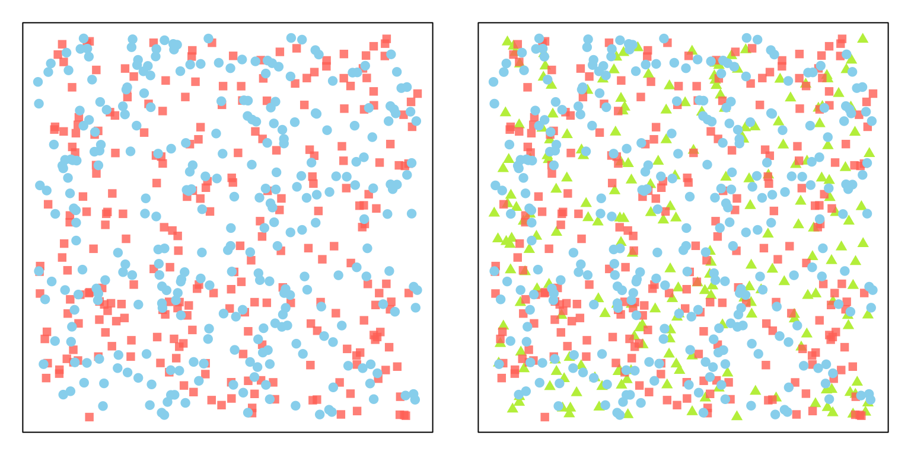

# Visualization

``` r
library(ramp.micro)
```

## 

``` r
load("bq_mod1.rda")
load("bqs_mod1.rda")
```

## Plot Points

``` r
par(mfrow = c(1,2), mar = c(1,1,1,1))
plot_points(bq_mod1)
plot_points(bqs_mod1)
```

 \## Dispersal
