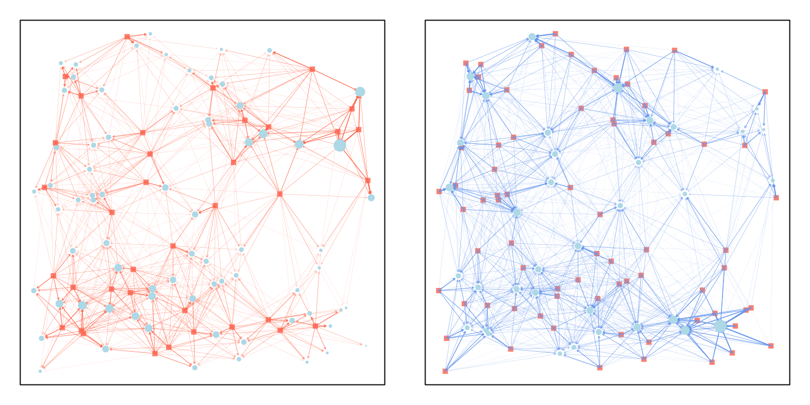
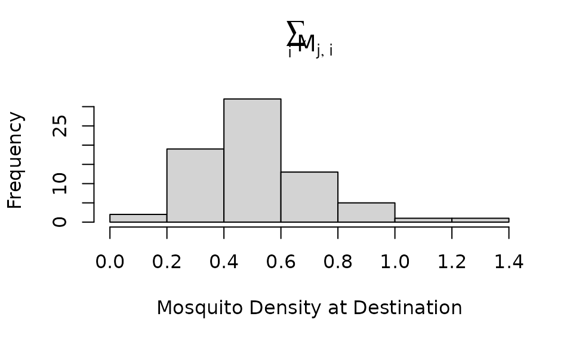
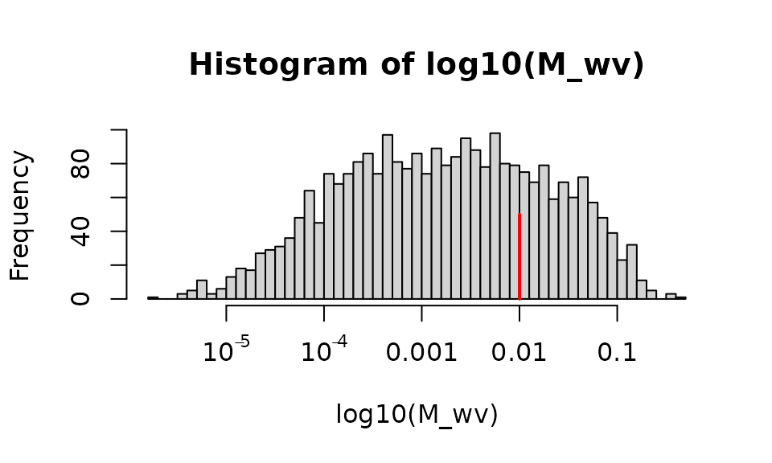
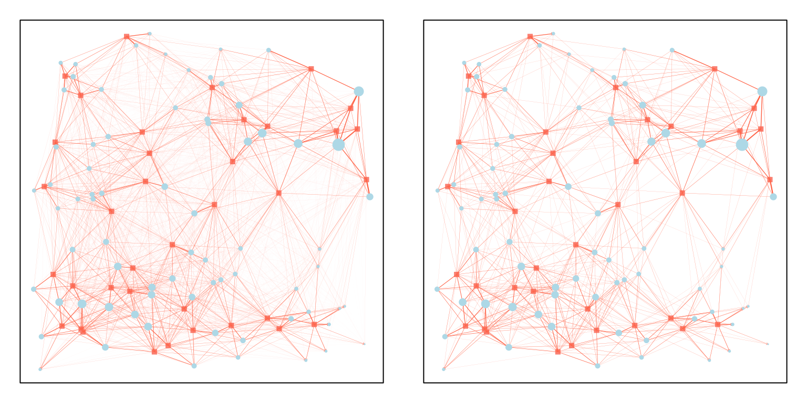
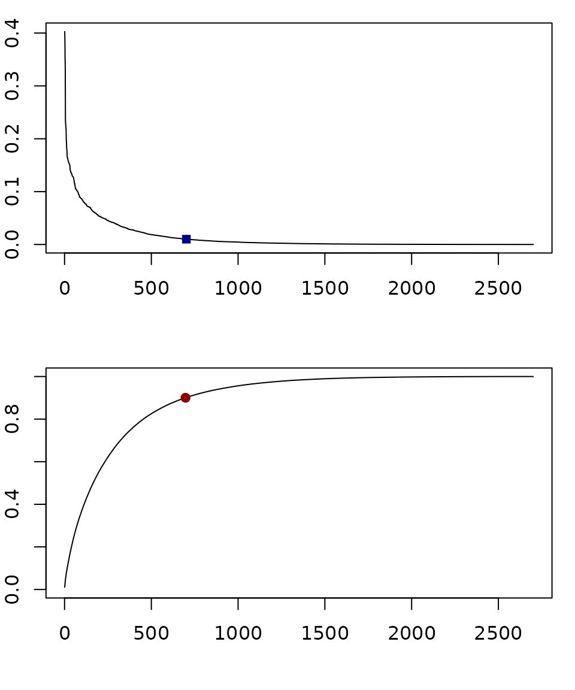
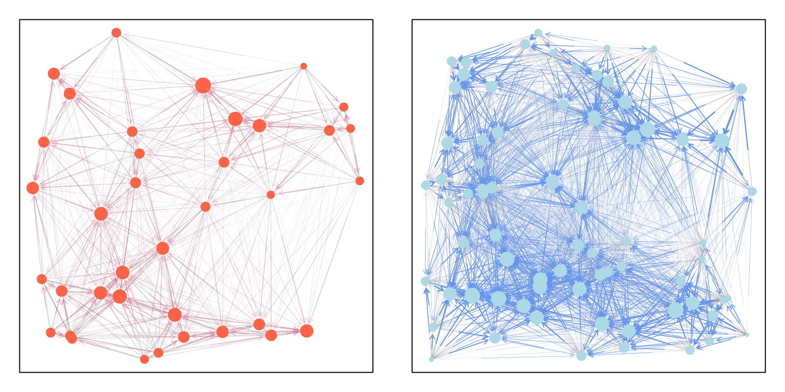

# Visualizing Micro-Dispersal

``` r
library(viridisLite)
library(knitr)
library(viridis)
library(ramp.micro)
set.seed(25)
```

## Introduction

In behavioral state micro-simulation, mosquito movement is defined by a
*search* for a resource, and all resources are located at points in
space, $(x,y).$ Micro-dispersal is defined herein as dispersal among
point sets representing the locations of resources.

Micro-dispersal models in this software implementation follow a common
notation:

- A search originates in one point set, $P_{v}$, with $|v|$ locations;
  and the destination is another, $P_{w}$ with $|w|$ locations.

- A dispersal model is instantiated as a matrix $M_{w\leftarrow v},$
  where the element $M_{i,j} \in M$ is the fraction of mosquitoes moving
  from $\left( x_{j},y_{j} \right) \in P_{v}$ to
  $\left( x_{i},y_{i} \right) \in P_{w}$.

- If we had a vector, $m_{v}$, of mosquito abundances at the origin of a
  search, and if we want to compute a vector, $m_{w}$, describing the
  number arriving at a destination, then we write
  $$m_{w} = M \cdot m_{v},$$ where

  - $\text{dim}(M) = |w| \times |v|,$

  - and $\left| m_{v} \right| = |v|,$

  - so $\left| m_{w} \right| = |w|.$

By convention, we constrain model so that,
$$\sum\limits_{i}M_{i,j} = 1.$$

If we want to model failed dispersal, then we will often want to handle
the case where the origin and destination are the same point set.

In the following, we discuss the challenge of visualizing
micro-dispersal matrices using functions in `motrap.micro` where either
$P_{v} \neq P_{w}$ or where $P_{v} = P_{w}.$

## Dispersal from $P_{v} \neq P_{w}$

To illustrate, we generate two point sets:

``` r
nPv = 37 
nPw = 73 
dd = 10
Pv = unif_xy(nPv,-dd, dd) 
Pw = unif_xy(nPw,-dd, dd) 
```

Now, we can define a dispersal matrix from $P_{v}$ to $P_{w}$, and *vice
versa*:

``` r
M_wv = make_Psi_xy(Pv, Pw, make_kF_exp())
M_vw = make_Psi_xy(Pw, Pv, make_kF_exp())
```

The generic function `plot_matrix_xy` was developed to plot dispersal
from $P_{v}$ to $P_{w}.$



## Movement

Because of the arrangement of points, some points in $P_{w}$ get more
mosquitoes. If an equal number of mosquitoes left every point in
$P_{v}$, the number arriving at each point in $P_{w}$ can be found by
summing the rows of the dispersal matrix, $M$:

``` r
hist(rowSums(M_wv), xlab = "Mosquito Density at Destination", main = expression(sum(M[list(j,i)], i)))
```



The matrix $M$ has `nPv`$= 29 \times$`nPw`$= 43$ elements, for a total
of $1,161$. This is a reasonably small number of points to consider, but
what if we increased the number of points in each set by a factor of 10
or 100? The size of the objects can grow quite large quite quickly.

We assume that mosquitoes are more likely to move to nearby sites. The
fraction going to each site is highly uneven. The model computes a
probability of moving between each pair of points, but *most* of the
elements fractions are very small.

``` r
hist(log10(M_wv), 40, xaxt = "n")
axis(1, -5:-1, c(expression(10^-5), expression(10^-4), "0.001", "0.01", "0.1"))
segments(-2, 0, -2, 50, col = "red", lwd=2)
```



In the following, we draw an arrow from the points in the starting set
($P_{v}$, salmon) to the points in the destination set ($P_{w}$,
lightblue). On the left, all the edges were plotted, but on the right,
edges were plotted only if the destination got more than 1% of the
dispersing mosquitoes. We vary the size of the destination point to be
the density of mosquitoes arriving:



In the top, we plot all the dispersal fractions for all the points in
order, and we added a dark blue dot at the point where we stopped
plotting.

Another way to set a cutoff is to compute the empirical cdf (the
cumulati e sum of the top graph) and plot 90% of the total mass (the
dark red dot in the bottom).

``` r
par(mfrow = c(2,1), mar = c(4,2,1,1))
ot = order(as.vector(M_wv), decreasing=T)
Mo = as.vector(M_wv)[ot]
plot(Mo, type = "l", ylab = "PMF", xlab = "")
ix1 = max(which(Mo>0.01))
points(ix1, Mo[ix1], pch = 15, col = "darkblue")

ecdf = cumsum(Mo)/sum(M_wv)
plot(ecdf, type = "l", ylim = c(0,1), xlab = "", ylab = "eCMF")
ix2 = min(which(ecdf >0.9))
points(ix2, ecdf[ix2], pch=19, col = "darkred")
```



## Self

``` r
Mvv = M_vw %*% M_wv
Mww = M_wv %*% M_vw
```



## Plot Size

We can now ask a practical question – how many edges would we plot if
the system was much larger:

``` r
nEdges = function(nS, nD, frac=0.01){
  dd = 10
  S = unif_xy(nS,-dd, dd) 
  D = unif_xy(nD,-dd, dd) 
  M = make_Psi_xy(S, D, make_kF_exp())
  ot = order(as.vector(M), decreasing=T)
  Mo = as.vector(M)[ot]
  ix1 = max(which(Mo>frac))
  c(ix1, nS*nD, ix1/nS/nD)
}
```

If we generated 20 models that were statistically indistinguishable from
the one above, we can compute the average number of edges plotted, and
the average fraction of edges showing.

``` r
t(replicate(20, nEdges(27, 43))) -> out
c(nEdges = mean(out[,1]))
```

    ## nEdges 
    ## 385.05

``` r
c(fracEdges =  mean(out[,3]))
```

    ## fracEdges 
    ## 0.3316537

If we start with ten times as many source and destination point, we end
up plotting about 20 times as many points:

``` r
t(replicate(20, nEdges(270, 430))) -> out
c(nEdges = mean(out[,1]))
```

    ##  nEdges 
    ## 7709.45

``` r
c(fracEdges =  mean(out[,3]))
```

    ##  fracEdges 
    ## 0.06640353

The plot is much busier to look at, but it renders in a reasonable
amount of time:

**This code was not run because it creates and stores an object that is
bigger than we wanted to store on github. Try running this code on your
computer and see what happens?**

``` r
nPv = 270 
nPw = 430 
dd=10
Pv = unif_xy(nPv,-dd, dd) 
Pw = unif_xy(nPw,-dd, dd) 
M = make_Psi_xy(Pv, Pw, make_kF_exp())
plot_matrix_xy(Pv, Pw, M, min_edge_frac = 0.02) 
```

If we plotted 50 times as many of each, now something suprising happens:

``` r
t(replicate(20, nEdges(270*5, 430*5))) -> out
c(nEdges = mean(out[,1]))
```

    ## nEdges 
    ## 2434.3

``` r
c(fracEdges =  mean(out[,3]))
```

    ##    fracEdges 
    ## 0.0008386908

We end up plotting fewer edges. What’s happening?

**This code was not run because it creates and stores an object that is
bigger than we wanted to store on github. Try running this code on your
computer and see what happens?**

``` r
nPv = 270*5 
nPw = 430*5 
dd=10
Pv = unif_xy(nPv,-dd, dd) 
Pw = unif_xy(nPw,-dd, dd) 
M = make_Psi_xy(Pv, Pw, make_kF_exp())
plot_matrix_xy(Pv, Pw, M, min_edge_frac = 0.01) 
```

The visualization is emphasizing the weights of points in the corner,
which have fewer neighbors than points near the center. The result is a
figure that illustrates both the importance of being able to visualize a
model, and the importance of understanding how this approach highlights
real and serious questions about mosquito dispersal – what happens at
the edges of habitats?
