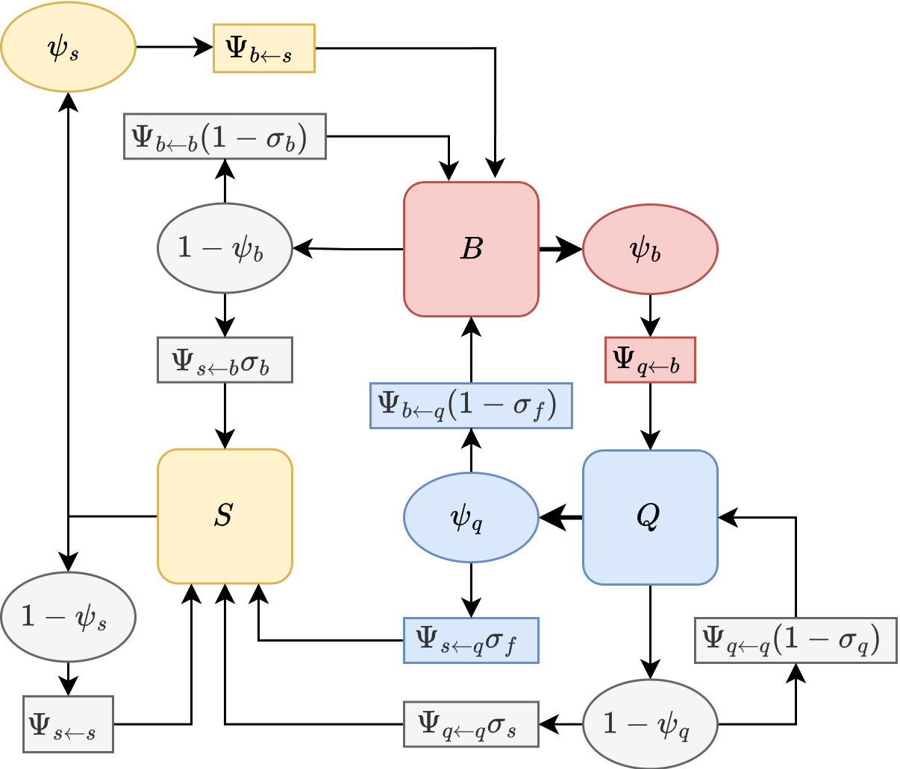

To quantify mosquito movement through one phase of the feeding cycle -- either blood feeding or egg laying -- that involves an initial search from another resource that could be followed by several failures, we developed a ``trap'' algorithm that computes isolates one part of the feeding cycle. 

To do so, we modify the simulation by setting to zero the parameters describing how mosquitoes would leave the *trap* state. We then initialize and follow a cohort from the point it enters that state, iterating until almost surviving mosquitoes accumulate in the end state (*i.e.*, up to a predefined tolerance). We let $K_{b\leftarrow q}$ denote a $|b| \times |q|$ matrix describing net dispersal to blood feed once: it is the proportion of mosquitoes leaving $\left\{q\right\}$ after laying eggs that eventually blood feed successfully at each point in $\left\{b\right\}$. Similarly, we define $K_{q \leftarrow b}$ denote net dispersal to lay eggs after. 

## BQ Model 

In the case of blood feeding, we begin with a cohort of mosquitoes in $\left\{q\right\}$ that has just successfully laid eggs. In the `BQ` model, all these mosquitoes launch in search of blood, some of them surviving to end up at a point in in $\left\{b\right\}$:

$$
B_0 = \Psi_{b \leftarrow q} \cdot \mbox{diag}\left(p_q \right)
$$
$B_0$ is thus defined as a $|b| \times |q|$ matrix. 

Some of these will successfully blood feed, and we divert these into the *trap* state, $T.$ It is initialized to zero but with the same shape as $B_0$:

$$
T_0 =  0 B_0 
$$
Now, we iterate until the sum of all elements in $B_t$ is negligible, or $\left\| B_t\right \| < \epsilon$: 

$$
\begin{array}{rl}
T_{t+1} &=  T_t + \mbox{diag}\left(\psi_b \right)  \cdot B_t \\
B_{t+1} &=    \Psi_{b \leftarrow b} \cdot \mbox{diag}\left(p_b \left(1-\psi_b \right)\right) \cdot B_t \\
\end{array}
$$
So that $$K_{b\leftarrow q} = \lim_{t \rightarrow \infty} T_t.$$ 

In the `BQ` model, we can use the same idea to compute $K_{q \leftarrow b}.$  These are the functions 
`compute_Kqb.BQ` and `compute_Kbq.BQ`

## BQS Model 

{width=100%}

### $K_{b \leftarrow q}$ 

$$
Q_0 = \mbox{diag}\left(p_q \right)
$$

In the BQS model, we start out the same way, but after leaving $\left\{q\right\},$ the trap is set at the end of blood feeding; since a blood meal is required to lay eggs, there are no transitions back to egg laying. 

$$
\begin{array}{rl}
B_0 &=  \Psi_{b \leftarrow q} \cdot \mbox{diag}\left((1-\sigma_f) \right) \cdot Q_0 \\
S_0 &=  \Psi_{s \leftarrow q} \cdot \mbox{diag}\left(\sigma_f \right) \cdot Q_0  \\
T_0 &=  0  B_0 \\ 
\end{array}
$$ 

Thereafter, we can compute the state transitions. Abusing notation a bit (we let $\left[ \right]$ indicate $\mbox{diag}\left(\right)$), Since no transitions back to $Q$ are possible, the trap matrix is: 

$$
\begin{equation}\begin{array}{l}
\left[
\begin{array}{c}
B_{t+1}  \\   
S_{t+1}  \\ 
T_{t+1}  \\ 
\end{array}
\right] = 
\left[
\begin{array}{ccc}
\Psi_{bb} \cdot \left[\left(1-\sigma_b\right)  p_b \
 \left(1- \psi_b \right) \right] & 
\Psi_{bs} \cdot \left[p_s \psi_s \right]  &  
0  \\
\Psi_{sb} \cdot \left[\sigma_b p_b \left(1-\psi_b \right) \right]
& \Psi_{ss}\cdot \left[p_s \left(1-\psi_s \right) \right] & 0  \\
\left[\psi_b \right]
& 0 & \left[1 \right]\\ 
\end{array}
\right] 
\left[
\begin{array}{c}
B_t  \\   
S_t \\ 
T_t
\end{array}
\right]  
\end{array}
\end{equation}
$$

### $K_{q \leftarrow b}$ 

The trap model for egg laying after blood feeding is more complicated because an unsuccessful egg laying attempt could be followed by a sugar feeding attempt. In this model, the implication is that the mosquito has reabsorbed the eggs, and another blood meal is required.  

$$
B_0  = \mbox{diag}\left(p_b \right) 
$$ 

$$
\begin{array}{rl}
Q_0 & =  0 \left(\Psi_{qb} \cdot B_0 \right) \\
S_0 & =  0 \left(\Psi_{bs} \cdot B_0 \right) \\
T_0 & =  0 Q_0 \\
\end{array}
$$ 
and the calculation is:  

$$
\begin{equation}\begin{array}{l}
\left[
\begin{array}{c}
B_{t+1}  \\   
Q_{t+1}  \\   
S_{t+1}  \\ 
T_{t+1}  \\ 
\end{array}
\right] = 
\left[
\begin{array}{ccc}
\Psi_{bb} \cdot \left[\left((1-\sigma_b)p_b(1-\psi_b) \right)\right] & 
0 & 
\Psi_{bs} \cdot \left[\psi_s p_s\right]   &  
0  \\
\Psi_{qb} \cdot \left[\psi_b p_b\right] &
\Psi_{qq} \cdot \left[ (1-\sigma_q) p_q (1- \psi_q) \right]& 
0 & 
0 \\ 
\Psi_{sb} \cdot \left[\sigma_b p_b (1-\psi_b) \right] & 
\Psi_{sq} \cdot \left[\sigma_q  p_s \left(1-\psi_q\right) \right]& 
\Psi_{ss} \cdot \left[1-\psi_s \right] & 
0  \\
0 & \left[\psi_q \right] & 0 & \left[1\right]\\ 
\end{array}
\right] 
\left[
\begin{array}{c}
B_t  \\   
Q_t  \\   
S_t \\ 
T_t
\end{array}
\right]  
\end{array}
\end{equation}
$$
